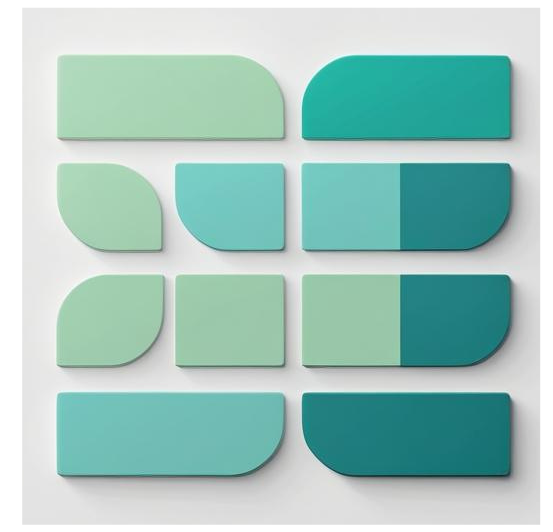

<div align="center">

# Mint Matrix 

[](https://opensource.org/licenses/MIT) [](https://github.com/KPR-V/surreal_hackathon) [](https://github.com/KPR-V/surreal_hackathon) [](https://github.com/KPR-V/surreal_hackathon/pulls) [](https://github.com/KPR-V/surreal_hackathon/graphs/commit-activity) [](https://github.com/KPR-V/surreal_hackathon/issues) [](https://github.com/KPR-V/surreal_hackathon/stargazers) [](https://github.com/KPR-V/surreal_hackathon/network/members) [](https://github.com/KPR-V/surreal_hackathon/graphs/contributors)




[🎬 **LIVE DEMO**](https://mintmatrix.vercel.app/) | [📹 **VIDEO WALKTHROUGH**](https://youtu.be/k0f0erdkw5Q) 

[](https://github.com/KPR-V/surreal_hackathon/issues/new?template=bug_report.md) [](https://github.com/KPR-V/surreal_hackathon/issues/new?template=feature_request.md) [](https://mint-matrix.gitbook.io/mint-matrix-docs)

</div>

* * * * *

🎯 Problem & Solution
---------------------

**The Challenge**
-----------------

Current IP management systems are fragmented and inefficient, forcing creators to navigate multiple platforms for registration, monetization, and protection. This results in:

-   **75% longer time-to-market** for IP assets

-   **Missed revenue opportunities** due to complex licensing processes

-   **Limited protection** against infringement and unauthorized use

-   **High barriers to entry** for individual creators and small businesses

**Our Solution**
----------------

Mint Matrix unifies the entire IP lifecycle into a single blockchain-powered platform, delivering:

-   **One-click IP registration** from AI-generated content to blockchain assets

-   **Automated royalty distribution** across derivative works and licensing chains

-   **Real-time infringement detection** powered by advanced AI algorithms

-   **Cross-chain accessibility** enabling global participation and liquidity

**Result**: Reducing time-to-market by 75% and increasing creator revenue potential through integrated secondary markets.

* * * * *


## 📝 Description

**Mint Matrix** is your one stop solution for **IP Registration** for any kind of asset for any step of registration it also provide you the ease of **AI Generation** and registratioon on the same platform and also allow you to see the **Global Market Place** and also has its **own Secondary Market Place** where you can sell and buy the royalty tokens and license tokens it also has **My Account** page for managing your account 

----
🎬 Live Demo
------------

**Experience Mint Matrix in action:**

🌐 **[Live Application](https://mintmatrix.vercel.app/)** 

📺 **[5-Minute Demo Video](https://youtu.be/k0f0erdkw5Q)** - Complete feature walkthrough

* * * * *
## ✨ Features

- ***Global Market Place***
   
  -   **Comprehensive Asset Discovery**: Browse all global IP assets registered on the Story Aeneid testnet with detailed technical specifications 

  -   **Advanced Analytics**: View transaction metadata, licensing details, and comprehensive IP family trees showing parent-child relationships 

  -   **Dispute Management**: Track and manage disputes related to specific IP assets with integrated resolution workflows 

  -   **Global Statistics Dashboard**: Real-time analytics and transaction insights across the entire Story testnet ecosystem 

  -   **Interactive Features**: Built-in tipping system and dispute filing capabilities for community engagement


- ***AI Generation***

   -   **Multi-Modal Content Creation**: Generate images, videos, and audio content through intuitive text prompts

   -   **Direct IP Registration**: Seamlessly register AI-generated content as IP assets on the Story blockchain 

   -   **Content Management**: Download, share, and manage generated assets with integrated IPFS storage 

   -   **Smart Wallet Integration**: Powered by Crossmint's smart wallet infrastructure with delegated signing capabilities 

   -   **Autonomous Agent Development**: Future-ready AI agents capable of autonomous IP registration and fund management using GOAT SDK 


- ***IP Registration Suite***
   -   **Multi-Stage Registration**: Support for users at any stage of the IP registration process 

    -   **Three-Tab Interface**:

          -   **IP Creation Hub**: Direct asset registration and minting capabilities

          -   **Derivative Management**: Handle derivative works and licensing relationships

          -   **License Token Operations**: Comprehensive license creation and management tools

    -   **Batch Processing**: Advanced bulk registration capabilities for multiple assets simultaneously

    -   **Story SDK Integration**: Full utilization of Story Protocol's native registration functions 


-  ***My Account*** 

   -   **Portfolio Management**: Comprehensive view of all owned IP assets with detailed metadata and licensing information 

   -   **Revenue Operations**: Claim revenue from IP assets and their derivative works with automated royalty distribution

   -   **License Compliance**: Fulfill derivative work obligations and manage parent IP royalty payments

   -   **Token Management**: View and manage license tokens, disputes, and complete transaction history

   -   **SPGF Contract Creation**: Built-in modal for creating SPGF contracts for new NFT collections 

   -   **Cross-Chain Operations**: Integrated token transfer capabilities and multi-chain bridge functionality using DeBridge 

- ***Secondary Market Place***
  -   **Royalty Token Trading**: Buy and sell percentage-based royalty tokens representing future IP asset earnings

  -   **License Token Exchange**: Trade license tokens with detailed pricing and ownership information

  -   **Market Analytics**: Real-time tracking of trading volume, average prices, and market movements

  -   **Multi-Currency Support**: Transactions conducted in IP tokens with real-time USD conversion rates 

  -   **Asset Intelligence**: Detailed IP asset information including metadata, PIL status, and ownership verification 

  -   **Custom Pricing Tools**: Flexible listing capabilities with personalized pricing strategies


----


## 🚀 Getting Started

### Prerequisites

- Node.js (v18 or higher)
- npm or yarn
- Git

### Installation

1. Clone the repository
```bash
git clone https://github.com/KPR-V/surreal_hackathon.git
```

2. Install dependencies
```bash
cd surreal_hackathon
npm install --legacy-peer-deps
```

3. add this to .env
```bash
LILYPAD_API_KEY=""
API_KEY="" #Models lab API key 
NEXT_PUBLIC_WALLET_CONNECT_PROJECT_ID=""
NEXT_PUBLIC_TOMO_CLIENT_ID=""
YAKOA_API_KEY=""
RPC_PROVIDER_URL="" #Story Aeneid RPC url
CROSSMINT_SERVER_API_KEY=""
OPENAI_API_KEY=""
TAVILY_API_KEY=""
NEXT_PUBLIC_STORY_API_KEY=""
PINATA_JWT=""
```
4. Start the development server
```bash
npm run dev
```

## 🛠️ Tech Stack

----
**Blockchain & IP Infrastructure**
----------------------------------

-   **Story SDK**: Complete integration for IP asset registration, licensing, and management on Story Protocol 

-   **Story Protocol**: Layer 1 blockchain designed as the foundation for programmable intellectual property 

-   **Tomo SDK**: Primary wallet connection provider offering seamless multi-chain wallet integration 

**AI & Content Generation**
---------------------------

-   **Crossmint Story Kit**: Simplified IP registration without blockchain complexities, gas fee management, and smart contract interactions 
-   **Crossmint Smart Wallets**: Advanced programmable wallet infrastructure with delegated signing and gasless transactions 
-   **GOAT SDK**: Financial toolkit enabling AI agents to become economic actors with autonomous transaction capabilities 

**Data & Security**
-------------------

-   **Yakoa API**: AI-powered infringement detection and brand authorization for IP assets and license minting 

-   **Pinata**: Decentralized IPFS storage solution for secure metadata and file management 

-   **DeBridge**: Cross-chain token swapping and bridging infrastructure connecting multiple blockchains to Story 


* * * * *

🔧 Sponsor Technology Integration
---------------------------------

**1. Story Protocol Integration**
------------------------------

-   **Primary Use**: Core IP asset registration, licensing, and management functionality

-   **Implementation**: Story SDK powers all IP-related operations including asset creation, derivative work management, and royalty distribution

-   **Location**: `/lib/story/` and integrated throughout all major features


**2. Tomo SDK Integration**
------------------------

-   **Primary Use**: Primary wallet connection provider across all platform interactions

-   **Implementation**: Seamless multi-chain wallet connectivity enabling users to interact with Story Protocol and other blockchain networks

-   **Location**: `/components/providers/wallet-provider.tsx`Integrated across all components requiring wallet functionality

**3. Yakoa API Integration**
-------------------------

-   **Primary Use**: IP infringement detection and brand verification services

-   **Implementation**: AI-powered analysis for IP asset validation, infringement checking, and brand authorization during license minting

-   **Location**: `/api/yakoa/` and integrated in IP registration , marketplace and ai-chat modules


**4. DeBridge Integration**
------------------------

-   **Primary Use**: Cross-chain functionality enabling token transfers from other networks

-   **Implementation**: Seamless token swapping and bridging infrastructure connecting multiple blockchains to Story Protocol

-   **Location**: `/app/my-account/deBridgeModal.tsx` bridge and swap modals


**5. Crossmint Integration**
-------------------------

-   **Smart Wallet Infrastructure**: User authentication, wallet creation, and gasless transaction management

-   **Story Kit Integration**: Simplified IP registration workflow without blockchain complexity

-   **Implementation**: Handles user onboarding, wallet management, and streamlined IP asset operations
-   **Tavily-pulgin**: Made a pulgin for tavily to use web search and web page extraction 
-   **Location**: `/api/crossmint/` , `app/ai-chat/smartWallet.tsx/` and `/lib/goat-plugins`

-   **Extended Functionality**: Crossmint's smart wallet technology enables delegated signing capabilities, allowing AI agents to perform transactions on behalf of users within predefined limits. The integration includes advanced features like programmable spending controls, automated transaction batching, and seamless fiat-to-crypto onramp for simplified user adoption.


* * * * *

## 📜 License

This project is licensed under the MIT License - see the [LICENSE](LICENSE) file for details.


---
## 👥 Team

- [Varun Kapoor](https://github.com/KPR-V) 
- [Sehaj Jain](https://github.com/Sehaj-0186)

----

## 📞 Contact

- Project Link: [https://github.com/KPR-V/surreal_hackathon](https://github.com/KPR-V/surreal_hackathon)
- Email: [kapoorv046@gmail.com](mailto:kapoorv046@gmail.com)
- Twitter: [@Vkiitr](https://twitter.com/Vkiitr)


* * * * *

🎯 Project Impact & Vision
--------------------------

Mint Matrix represents a paradigm shift in how creators interact with intellectual property in the digital age. By combining the power of Story Protocol's programmable IP infrastructure with cutting-edge AI generation and user-friendly interfaces, we're democratizing access to IP management tools that were previously only available to large corporations. The platform addresses the growing need for creators to protect and monetize their work in an AI-driven economy where intellectual property serves as the foundational asset class 

Our integrated approach eliminates the traditional barriers between content creation, IP registration, and monetization, creating a seamless workflow that empowers creators at every level. Through innovative features like AI-powered content generation with direct blockchain registration, comprehensive marketplace analytics, and advanced smart wallet functionality, Mint Matrix is positioned to become the definitive platform for the next generation of IP management and trading.